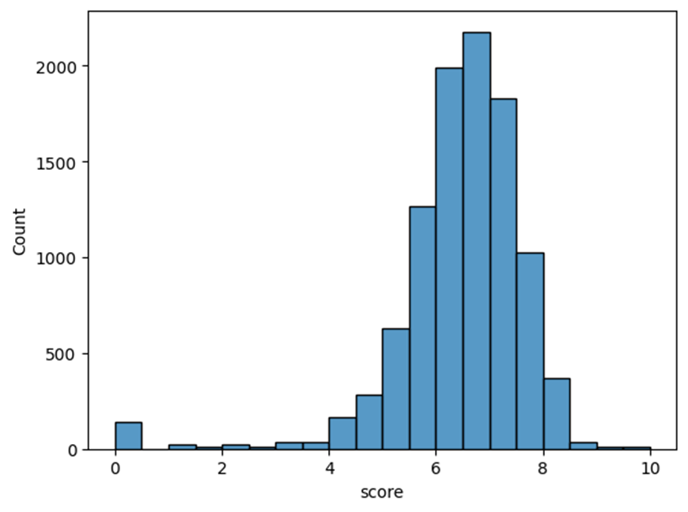

# Background

## In a Sentence (or three)

Submitted as the Capstone project as part of my Bachelor of Science in Computer Science. Requirements were to create a solution that addressed a business problem using Machine Learning. **Please see User Guide on how to run this within Google Colab**

# The Problem

Producing films is increasingly expensive, and innumerable factors contribute to a movie’s success. Traditionally, a movie is considered a financial success if it recoups twice its production budget, which is a rule of thumb that considers marketing and promotional costs. However, the market has shifted due to streaming and the lack of home movie rentals and sales, with an additional focus on critical and audience reception. With the amount of content available at any given time, having a high-caliber and well-liked offering can increase the chances of a sustained audience.
The application provides a way to input some factors that contribute to a movie’s success, including the release date, genre, cast, budget, language, and country, and it uses machine learning to produce an estimated user/audience score. A higher user score increases the chance of critical success, capturing an audience and associated revenue.

# The Technical Details

## Data Summary

The primary data source is publicly available data, specifically from Kaggle, that has been originally sourced from The Internet Movie Database (IMDB). Duplicate and incomplete data was removed, being mindful to maintain duplicate titles that were produced in separate years (remakes, movies from different territories, etc.).

## Machine Learning

Gradient boosting was used as the machine learning method for this regression problem, since it involves predicting continuous numerical values based on independent variables. Specifically, Extreme Gradient Boosting (XGBoost) was used and included as a standalone library. XGBoost was chosen because it is a straightforward and effective supervised algorithm that can be applied to linear regression problems.

## Validation

The gradient boosting method is validated by calculating the R2 score, the coefficient of determination, or a measure of how well the model explains the variance in the target variable. In this case, the target variable is a movie's User/Audience score. The results of the R2 score are 0.322, which isn’t particularly strong; however, it is acceptable given the high noise (incorrect budgets and revenues) and the amount of variability between all of the features, such as cast, genre, language, and country.

# Visualizations

This histogram represents the spread of the user score for all the movies. It’s interesting to note that most films land between a score of six and seven.

This bar graph represents the importance of each feature, with Korean language, Animation, and Australia as a country being the most important to the training model.

This scatter plot with a regression line showcases the predicted and actual user scores. The closer a point is to the line, the more accurate the model predicted the movie's score.

# User Guide

The project is hosted on Google Colab, which makes running and sharing a Jupyter Notebook project straightforward. Follow the step-by-step instructions to explore the application without creating an account or downloading anything. Please note: You will need to be logged into a Google account to run the code.

Steps:

1. Visit https://colab.research.google.com/drive/11Mpi0UZle7kc6SzBjRuJJIIyCub9Ha8t?usp=sharing
   a. Note: There are instructions included in the Notebook and a table of contents on the left-hand side to help you navigate.
2. In the top cell, hover the cursor over it, and a white play button will appear in the top left corner. Press play to run it, and make sure a green checkmark appears just to the left of the cell before continuing. This builds out the logic and classes of the application.
3. Scroll down or click on Step 2 in the table of contents. Run this cell the same way, waiting until the green checkmark appears beside the cell near the white button before going to the next step. You have now trained the model with the data.
4. Scroll down or click on “Final step[…]” and run this cell, which is how you interact with the application (the GUI).
5. Answer the prompts, which include the date of release, genre, cast, language, budget, and country of release. Once complete, it will output the predicted User Score.
   For example, you can try using any actors and genre you imagine, or you can use any movie that was released in 2024. I’ve included an example of Deadpool vs. Wolverine in the application itself and will repeat it below:
   • Date: 2024-07-26
   • Genre: Buddy Comedy, Action, Comedy, Superhero, Adventure
   • Cast: Ryan Reynolds, Hugh Jackman, Emma Corrin, Matthew Macfadyen, Dafne Keen, Jon Favreau, Morena Baccarin, Rob Delaney, Leslie Uggams
   • Language: English
   • Budget: 200000000
   • Country: AU
   It will now print out its predicted user score.
